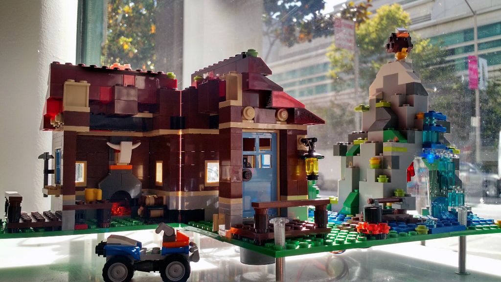

# LEGO Smart Home and Home Controller Lite UI

This simplified version of Raspberry Pi House code samples and the home controller user-interface are written for blog tutorials.

The actual code is *not* the actual code used for the LEGO house displayed at PubNub office window display. We (Tomomi Imura and Bhavana Sninivas) re-created a circuit for each component, and re-wrote the code in python to publish as easy-to-follow tutorials.

## Tutorials including the Circuits

1. [Building a Raspberry Pi Smart Home (Part 1)](http://www.pubnub.com/blog/tutorial-building-raspberry-pi-smart-home-part-1/)
2. [Building a Raspberry Pi Smart Home (Part 2)](http://www.pubnub.com/blog/building-raspberry-pi-smart-house-part-2/)

## Raspberry Pi Python Code Samples

- [Temperature and humidity sensors](https://github.com/pubnub/pi-house/blob/gh-pages/python/temp-hum.py)
- [Light control](https://github.com/pubnub/pi-house/blob/gh-pages/python/pwm-led-gpio.py)

 
## Home-Controller Web Interface

- [index.html](index.html)
- [app.js](js/app.js)
