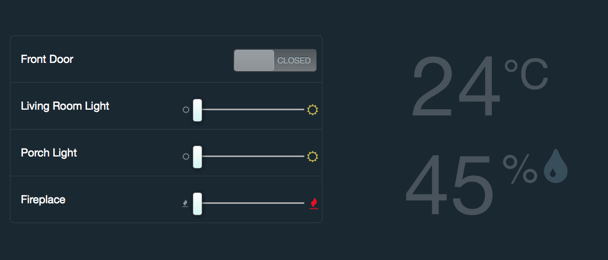

##Introduction

The pi house is a lego house that has a raspberry pi model B+ for a brain. It has lights, sensors and a door that can be controlled using a mobile device from anywhere in the world.

This post will focus on the temperature humidity sensor in the house. I will take you through the steps of setting up the hardware, hooking it up with PubNub, and finally viewing the readings on a browser. This is the first step in building a fully working IoT implementation, both on the hardware and software side.

For an in depth tutorial on how to set this up, check out the blog.

##Concept

The house represents the Pi house with the lights, sensors and door. Using PubNub, you can achieve **bidirectional communication** between the devices at home and your mobile/browser:

* Read the sensor values such as temperature and humidity on a browser or mobile device. 

	######(SENSOR/LIGHT ----> BROWSER/MOBILE DEVICE)

* Monitor the same devices, and send control messages to them, to turn them on/off, to check their state and to take any action on them. 

	######(BROWSER/MOBILE DEVICE ----> SENSOR/LIGHT)

This information is sent from one device to the other, without having to open any ports on the devices, through firewalls and irrespective of the network they are on. PubNub is the key communication component between all the **things** in the **Internet of Things**.

##Hardware - sensor 101

The DHT22 is a basic, low-cost digital temperature and humidity sensor. It uses a capacitive humidity sensor and a thermistor to measure the surrounding air, and spits out a digital signal on the data pin.

##Software - PubNub 101

###What is PubNub doing here? 

PubNub is a secure data stream network, that provides easy to use API to build and scale real time applications. PubNub is used in several verticals such as home automation, taxi dispatch, financial services, gaming and many more. 

This Pi house is all about IoT, and IoT is all about the devices communicating with each other in real time. PubNub is what enables that communication between devices. Whether its a mobile device or a web broswer talking to embedded devices, sensors or any other device, PubNub glues them  together.

In this specific example, you use the browser to communicate with the sensors and the Pi, to ask for temperature and humidity values. The sensor measures them, and sends it back over PubNub, allowing you to visualize it on your browser.

##Visualization - UI

The Pi house is all about controlling and reading device values in real time. You can view this by opening the [UI](http://pubnub.github.io/pi-house/) which gives a comprehensive look of all the devices in your house. You can [control the lgihts](link to Tomomi's blog) and even view the temperature and humidity readings. This is what we are interested in. 

If you are running the python script on the Pi, you can see how the temperature and humdity values from the sensor can be seen. They update themselves in real time, thus making it very easy for you to make decisions based on these values. This way, you can be anywhere in the world, and view this data, and make smart decisions. 

 
