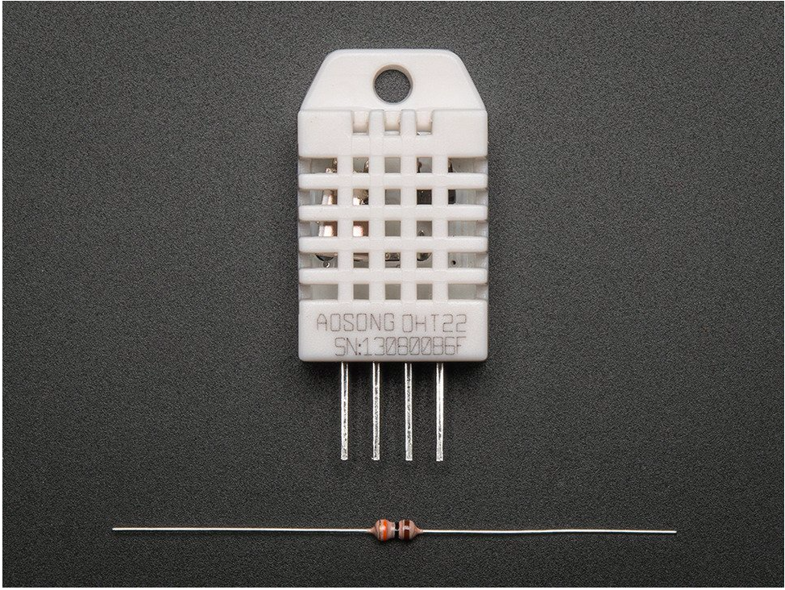
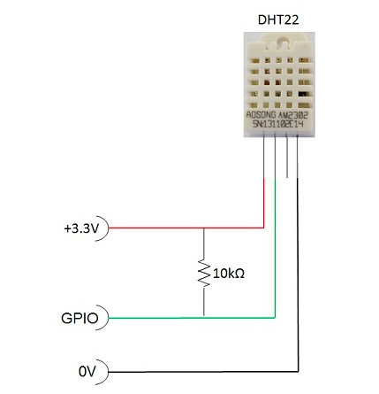
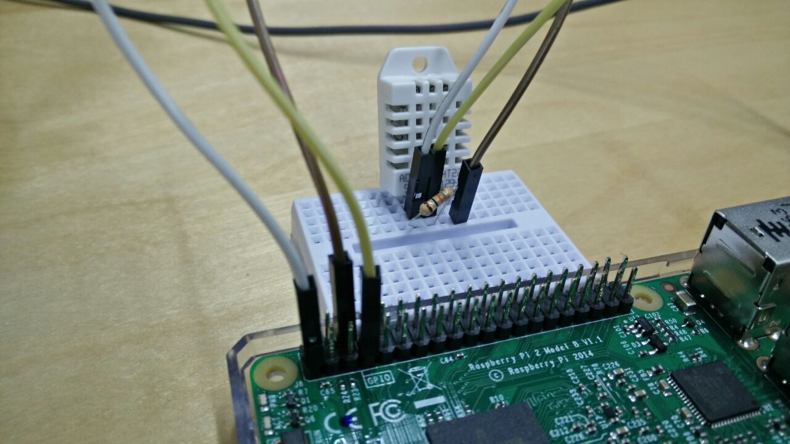
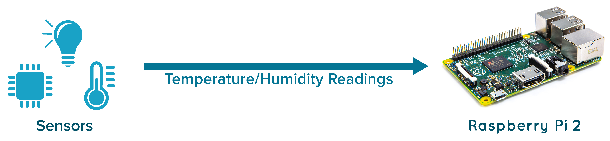
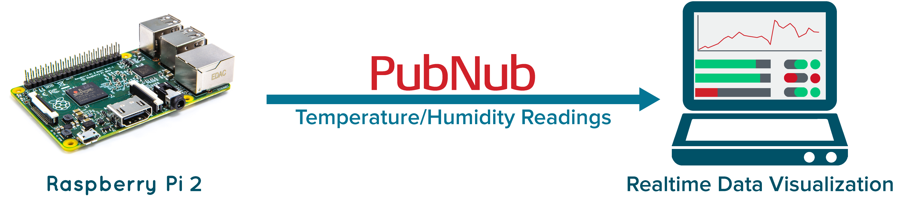
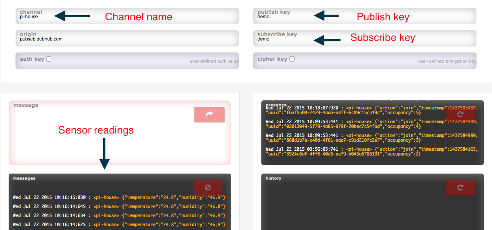

##Introduction

We promised you that we will dig deeper into the individual hardware and software components of the Pi house. The pi house is a lego house that has a raspberry pi model B+ for a brain. It has lights, sensors and a door that can be controlled using a mobile device from anywhere in the world.

This post will focus on the temperature humidity sensor in the house. I will take you through the steps of setting up the hardware, hooking it up with PubNub, and finally viewing the readings on a browser. This is the first step in building a fully working IoT implementation, both on the hardware and software side.

##Concept


The house represents the Pi house with the lights, sensors and door. Using PubNub, you can achieve **bidirectional communication** between the devices at home and your mobile/browser:

* Read the sensor values such as temperature and humidity on a browser or mobile device. 

	######(SENSOR/LIGHT ----> BROWSER/MOBILE DEVICE)

* Monitor the same devices, and send control messages to them, to turn them on/off, to check their state and to take any action on them. 

	######(BROWSER/MOBILE DEVICE ----> SENSOR/LIGHT)

This information is sent from one device to the other, without having to open any ports on the devices, through firewalls and irrespective of the network they are on. PubNub is the key communication component between all the **things** in the **Internet of Things**.


##Hardware - sensor 101

The DHT22 is a basic, low-cost digital temperature and humidity sensor. It uses a capacitive humidity sensor and a thermistor to measure the surrounding air, and spits out a digital signal on the data pin.


###How to connect it to the Pi?

####What you will need

1.The DHT22 sensor


2.3 jumper wires 
3.Breadboard  
4.4.7kΩ (or 10kΩ) resistor
5.Raspberry Pi B+ loaded with the Raspbian OS. 

Set up the circuit according to the following figure: 



which translates to 



I have connected to GPIO4 (pin7), pin 1 for the voltage (3v3) and pin 6 for ground. The resistor goes between the first two pins of the sensor. The third pin of the sensor need not be connected to anything.

###How do you read values from it?

We need to use Adafruits DHT library to be able to read the temperature values from the sensor.

The Python code to work with Adafruit's DHT sensors is available on [Github](https://github.com/adafruit/Adafruit_Python_DHT).


Open LXTerminal, and download and install the followings:

**Install Python:**

`pi@raspberrypi ~$ sudo apt-get install python-dev`

**Install pip:**

`pi@raspberrypi ~$ sudo apt-get install python-pip`

**Downloading the Adafruit DHT library:**

`pi@raspberrypi ~$ git clone https://github.com/adafruit/Adafruit_Python_DHT.git`

`pi@raspberrypi ~$ cd Adafruit_Python_DHT`

**Installing the library**

`pi@raspberrypi ~$ sudo python setup.py install`

This should compile the code for the library and install it on your device so any Python program can access the Adafruit_DHT python module.


##Software - PubNub 101

###What is PubNub doing here? 


PubNub is a secure data stream network, that provides easy to use API to build and scale real time applications. PubNub is used in several verticals such as home automation, taxi dispatch, financial services, gaming and many more. 

This Pi house is all about IoT, and IoT is all about the devices communicating with each other in real time. PubNub is what enables that communication between devices. Whether its a mobile device or a web broswer talking to embedded devices, sensors or any other device, PubNub glues them  together.

In this specific example, you use the browser to communicate with the sensors and the Pi, to ask for temperature and humidity values. The sensor measures them, and sends it back over PubNub, allowing you to visualize it on your browser.

###Code explanation

####Step 1:Reading the sensor values

The code snippet below makes the pi read the humidity and temperature values from the sensor and print it out.




```
h,t = dht.read_retry(dht.DHT22, 4)
print 'Temp={0:0.1f}*C Humidity={1:0.1f}%'.format(t, h)

```


So, now we have a sensor that keeps measuring data but not doing much with it. You want to be able to view this information on a browser or mobile device in real time, to be able to do something meaningful with it. Enter PubNub. 

 

####Step 2:Installing PubNub

**Install PubNub:**
`pi@raspberrypi ~$ sudo pip install pubnub`

For an in depth introduction to the Pi and PubNub, check this [blog](http://www.pubnub.com/blog/internet-of-things-101-getting-started-w-raspberry-pi/).

Make sure you have [signed up for PubNub](https://www.pubnub.com/get-started/) to obtain your pub/sub keys.


#####Importing the libraries

You make sure you import the right libraries needed for this program. You initialize an instance of PubNub by setting the publish and demo keys which you get when you [sign up](https://www.pubnub.com/get-started/) for the service. 

Channel is where you publish the message to, so choose a unique name for that. 

```
	import os
	import time
	import sys
	from Pubnub import Pubnub
	import Adafruit_DHT as dht
	pubnub = Pubnub(publish_key='demo', subscribe_key='demo')
	channel = 'pi-house'
```


####PubNub publish/subscribe

In order to view these readings on your browser or mobile device, you will need to **publish** them on a specific channel using PubNub. The browser will **subscribe** to the same channel, and hence receive the message. 

Here we are formatting the data to two decimal places, forming a message to be sent over PubNub, and finally publish the message.




```
temp='{0:0.1f}'.format(t)
hum='{0:0.1f}'.format(h)
message = {'temperature': temp, 'humidity': hum}
pubnub.publish(channel=channel, message=message, callback=callback, error=callback)

```

##Visualization - UI

The Pi house is all about controlling and reading device values in real time. You can view this by opening the [UI](http://pubnub.github.io/pi-house/) which gives a comprehensive look of all the devices in your house. You can [control the lgihts](link to Tomomi's blog) and even view the temperature and humidity readings. This is what we are interested in. 

If you are running the python script on the Pi, you can see how the temperature and humdity values from the sensor can be seen. They update themselves in real time, thus making it very easy for you to make decisions based on these values. This way, you can be anywhere in the world, and view this data, and make smart decisions. 


##PubNub console

But if you dont want to build a UI, don't worry. The [PubNub Developer Console and Debugger](http://www.pubnub.com/console/) is another way to view messages from PubNub. If you do not have a web page displaying your data, you can still control and receive messages from the house, using the PubNub developer console. It is an easy debugger, where you have to put it in your keys and channel name (same as in the python script). In the message column, you will see the sensor readings as shown below.




##Conclusion

We will be posting more tutorials on how to control the lights in the house, how to change their intensity and also how to flicker them. Stay tuned for more pi goodyness.

 
